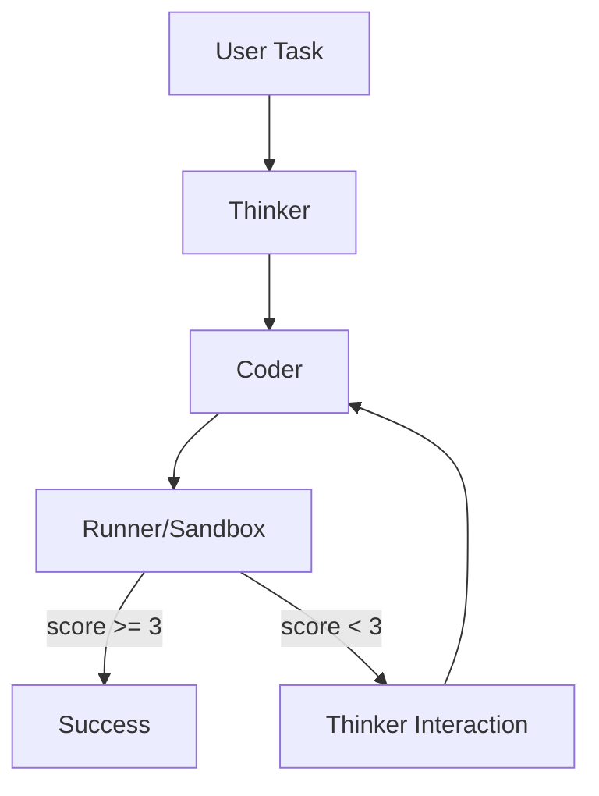

# L.A.P.H. Architecture

This document describes the core pipeline of L.A.P.H. and the plugin pattern.

## Core components

- `main.py` / `__main__.py`: entrypoints for CLI and GUI
- `core/cli.py`: click CLI and output streaming
- `core/gui.py`: Tkinter GUI layer and callback wiring
- `core/repair_loop.py`: iterative loop, plugin loader, evaluation, repair
- `core/runner.py`: sandboxed process execution
- `core/plugins`: plugin interface and defaults

## Plugin pattern

- add new plugin in `core/plugins`
- update `configs/plugins.toml`
- no core loop edits required
